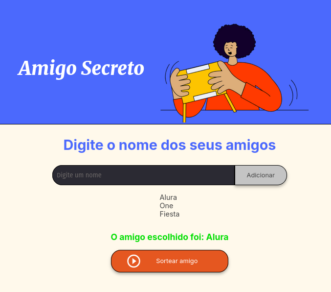

## CHALLENGE-AMIGO-SECRETO

O CHALLENGE AMIGO SECRETO é um projeto voltado a criar um programa simples que
sorteia um amigo de forma aleatória entre as opções inseridas pelo o usuário.

### Exemplo

<!--  -->
1. Digite o nome de alguém que queira adicionar na lista a ser sorteado e click em 'Adicionar'.
2. Quando inserir todos os participantes desejados basta clicar em 'Sortear Amigo' para sortear alguém aleatoriamente.

